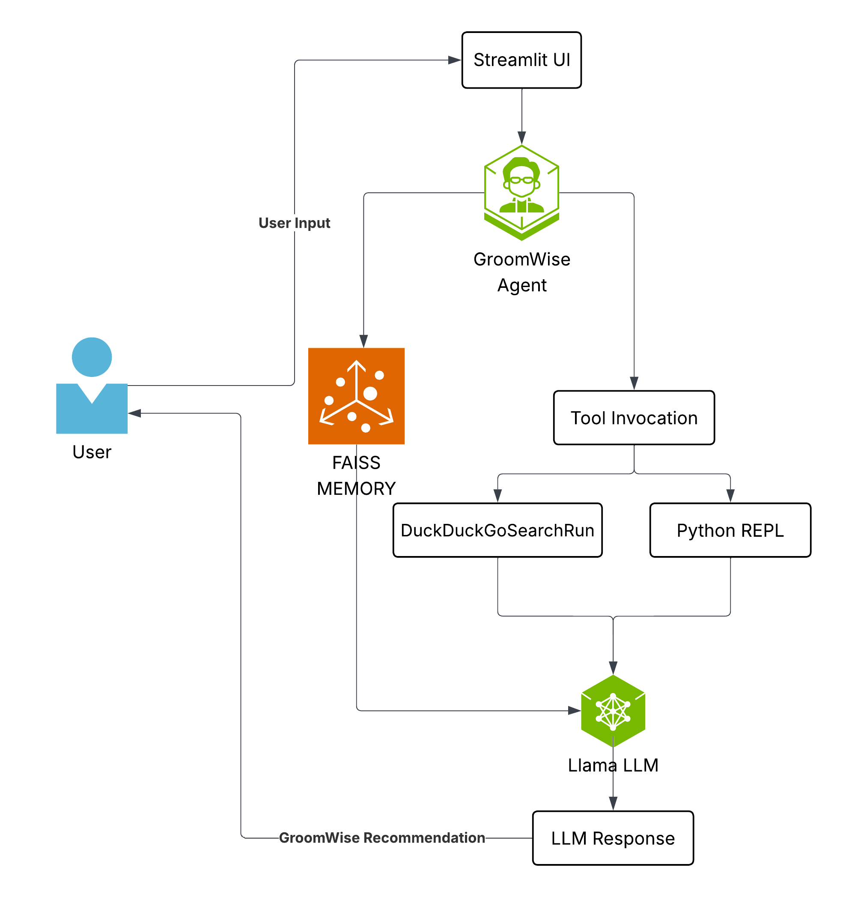

# GroomWise: Your Personalized Skin & Grooming AI Agent

GroomWise is a task-oriented AI agent built with LangChain. It assists users by understanding their skin, hair, and grooming concerns, along with their budget, to recommend suitable self-care products. The agent leverages a Large Language Model (LLM), web search capabilities, and calculation tools to provide personalized advice.

## 🚀 Agent Architecture & Components

*   **LLM:** Llama3 via GROQ
*   **Agent Type:** `ZERO_SHOT_REACT_DESCRIPTION`
    *   **Reasoning:** This agent type is chosen for its ability to dynamically decide which tool to use (ReAct paradigm) based on tool descriptions.
*   **Memory:** `ConversationBufferWindowMemory`
    *   **Reasoning:** Used to maintain conversation history (e.g., last 5 turns), allowing for contextual understanding.
*   **Core Tools Used:**
    1.  **DuckDuckGoSearchRun:**
        *   **Purpose:** To fetch real-time information about products, ingredients, skincare/haircare advice, and product availability/pricing from the web.
    2.  **PythonREPLTool (from `langchain_experimental`):**
        *   **Purpose:** To perform numerical calculations, primarily for budget checking (e.g., "Is product price X less than budget Y?"). It allows the agent to make precise financial decisions based on user constraints.

## 🛠️ Tool Integration & Rationale

*   **DuckDuckGoSearchRun:** Integrated to provide the agent with access to up-to-date information. For a grooming assistant, this is crucial as product availability, formulations, and prices change.
*   **PythonREPLTool:** This tool is vital for handling budget constraints effectively. The LLM can formulate simple Python expressions (e.g., `750 < 1000`) based on extracted product prices and user-defined budgets. The REPL executes these expressions, giving a concrete True/False that guides the agent's recommendations.

## 🧱 Folder Structure

```
groomwise-agent/
├── app/
│   └── streamlit.py              # Streamlit-based chat UI for GroomWise
├── src/
│   ├── __init__.py              # Module declaration
│   └── groomwise_agent.py       # Core agent logic with tools, memory, prompt, and execution loop
├── .env                         # API keys and environment configs
├── requirements.txt             # All Python dependencies
└── README.md                    # Project overview and setup
```

## ⚙️ Setup and Installation Steps

1.  **Clone the Repository**

2.  **Create and Activate Virtual Environment:**
    ```bash
    python -m venv venv
    # Windows: venv\Scripts\activate
    ```

3.  **Install Dependencies:**
    ```bash
    pip install -r requirements.txt
    ```

4.  **Set Up Environment Variables:**
    Create a `.env` file in the root of the project directory:
    ```
    GROQ_API_KEY="YOUR_GROQ_API_KEY"
    ```
    Replace `"YOUR_GROQ_API_KEY"` with your actual API key from GROQ.

## ▶️ Usage Instructions

1.  **Run the Agent (CLI):**
    ```bash
    python src/groomwise_agent.py
    ```

2.  **Launch the Streamlit Interface (GUI):**
    ```bash
    streamlit run app/streamlit.py
    ```

3.  **Interact with GroomWise:**
    The agent will greet you. Type your grooming-related questions or concerns.
    Examples:
    *   "I have oily skin and a budget of 1000 PKR. What face wash do you recommend?"
    *   "Suggest a hair oil for dry scalp, preferably coconut-based."
    *   "What's a good daily routine for combination skin in summer?"
    *   Type `exit` to end the conversation in CLI mode.

## 💡 Known Issues & Future Improvements

*   **Search Result Specificity:** The quality of DuckDuckGo search results can vary. Sometimes specific product prices or local availability might be hard to find directly.
*   **Python REPL Robustness:** While useful for simple checks, complex queries requiring the LLM to generate intricate Python code for the REPL might be error-prone.
*   **No Long-Term Memory:** The current memory is conversational (short-term). User preferences across sessions are not stored.
*   **Limited Product Database:** The agent relies solely on web search; it doesn't have an internal, curated product database.

**Future Improvements:**
*   **Integrate a Vector Database (e.g., ChromaDB, FAISS):** For long-term memory of user preferences or even a cached database of popular products.
*   **Use LangGraph:** To model more complex, cyclical, or stateful agent workflows.
*   **More Specific Tools:** Develop custom tools for parsing e-commerce sites (ethically and respecting `robots.txt`) or for more structured product information retrieval.
*   **UI Implementation:** Build a Streamlit or Flask interface for a richer user experience.
*   **Advanced Error Handling:** Implement more sophisticated error handling and recovery mechanisms for tool failures.

## 📐 Agent Architecture Diagram (High-Level)



> This diagram illustrates the flow of user input through the Streamlit UI into the LangChain agent. The agent invokes tools such as `DuckDuckGoSearchRun` and `PythonREPLTool` when necessary and passes observations and memory into the LLM (powered by GROQ). Based on tool results and reasoning, the LLM generates a final recommendation, presented back to the user as GroomWise's response.
